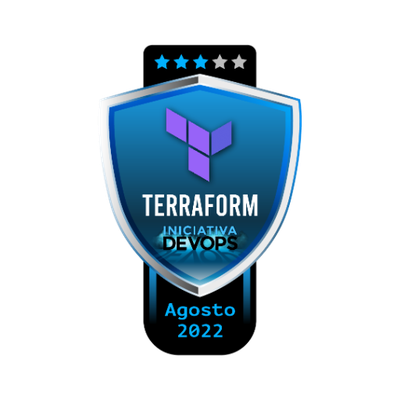

# Iniciativa DevOps | Day 3 - Terraform

## :brain: Conceitos aprendidos
Projeto Iniciativa DevOps da @KubeDev | Aprendizado e Hands-on em ``Terraform``

- Conceitos de infraestrutura como código
- Estrutura do Terraform
- Criação de um cluster Kubernetes com Terraform na Digital Ocean